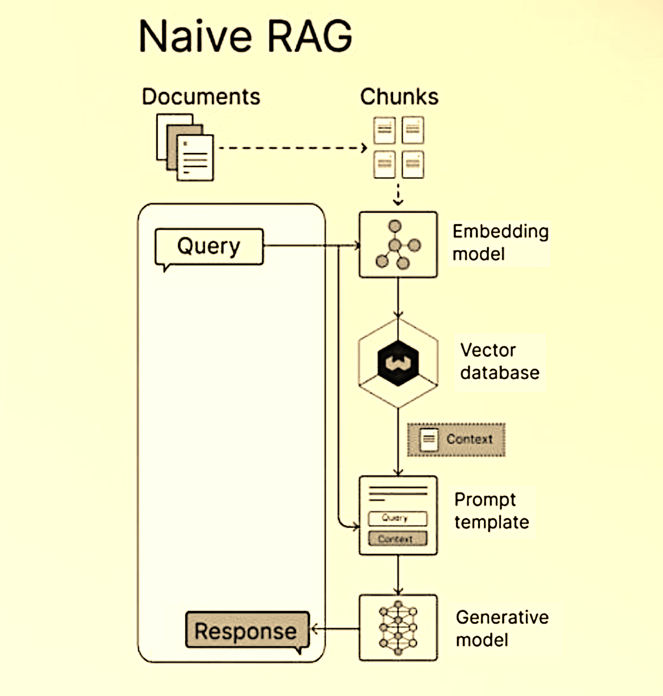

# 📂 NaiveRAG – Modular Local Retrieval-Augmented Generation (MVP/POC)

**Role:** AI Workflow Engineer & Full-Stack Python Developer

**Status:** Production-ready MVP/POC – Modular & Extensible

---

## 📘 Project Overview

NaiveRAG is a fully operational Retrieval-Augmented Generation (RAG) system designed to answer complex queries using content extracted from PDF documents.

The system processes files through a structured sequence of independent modules:

* **PDF Parsing** → Converts uploaded files into structured text.
* **Text Chunking** → Splits long documents into overlapping segments for semantic processing.
* **Vectorization & Indexing** → Transforms chunks into searchable embeddings.
* **Query Matching** → Identifies the most relevant chunks per query.
* **Answer Generation** → Produces clear, contextually grounded responses.

Each step is modular, testable, and interchangeable, making the architecture ideal for both experimentation and real-world extension.

---

## 🔍 Skills & Deliverables

* Retrieval-Augmented Generation
* Semantic Text Segmentation
* Generative AI
* AI Agent Development
* Vector-Based Information Retrieval

---

## ✅ Applicable Domains

NaiveRAG can be adapted to a wide range of industries and data contexts:

* **Legal** – Contracts, laws, and case law review
* **Healthcare** – Medical papers, protocols, clinical guidelines
* **Enterprise** – Internal procedures, corporate reports, HR documentation
* **Academia** – Scientific research papers, theses, academic publications
* **Finance** – Audits, compliance docs, internal memos
* **Tech Docs** – APIs, developer manuals, system architectures

---

## 🔧 Customization & Integration Potential

NaiveRAG is built for flexibility and integration. Each stage—ingestion, segmentation, indexing, retrieval, generation—can be adapted independently to fit client-specific environments.

Whether integrating into internal knowledge bases, exposing as an API, or embedding into existing tools and dashboards, the architecture supports seamless deployment. It's suitable for private cloud, on-premise, and containerized workflows.

---

## 👀 Demo & Showcase

> **Note:** This is a private showcase repository.
> No source code is publicly available.

  

---

## 📩 Contact

For partnerships, integration requests, or licensing inquiries:

📧 **[coder1@bravog.com](mailto:coder1@bravog.com)**
🌐 **[bravog.com](https://bravog.com)** (coming soon)

---

## 🌐 Other Languages

* [`README.pt-br.md`](README.pt-br.md) – Português do Brasil 🇧🇷
* [`README.es.md`](README.es.md) – Español Sudamérica 🇪🇸
